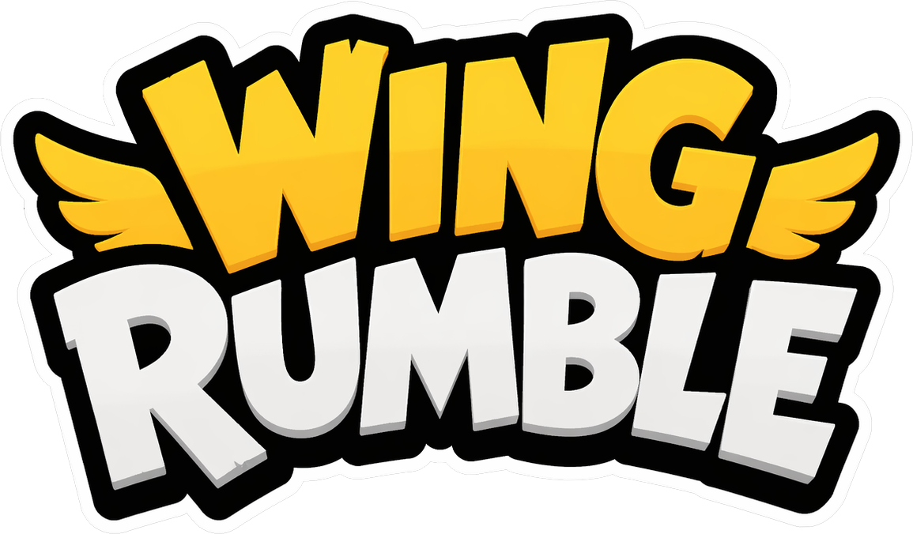

# Wing Rumble

<p align="center">
  
</p>

**Wing Rumble** é uma plataforma de minigames no navegador em que o **corpo inteiro** é o controle: a webcam captura sua pose em tempo real e o jogo traduz movimento em ações.

---

## Visão geral

- **Entrada principal:** detecção de pose com [TensorFlow.js](https://www.tensorflow.org/js) e o modelo **MoveNet** (`@tensorflow-models/pose-detection`), com backend WebGL quando disponível.
- **Modos:** jogo solo ou **dois jogadores** na mesma câmera (posições à esquerda e à direita do quadro).
- **Fluxo:** telas de carregamento, seleção de modo (partida rápida ou escolher jogo), detecção de jogadores, contagem regressiva e partida em tela cheia opcional.

A arquitetura do código separa **detecção de pose**, **mapeamento para input abstrato** e **lógica de cada minigame**, para facilitar novos jogos e testes com teclado ou mocks quando aplicável.

---

## Minigames

| Jogo | ID interno | Ideia |
|------|------------|--------|
| **Corrida 100 m** | `sprint100m` | Movimento de corrida no lugar para avançar na pista. |
| **Quebra-blocos** | `blockBreaker` | Use os punhos para acertar blocos (detecção por movimento dos pulsos). |
| **Limpe a tela** | `cleanScreen` | “Esfregue” a sujeira com as mãos até limpar. |
| **Coleta de frutas** | `collect` | Pegue frutas e evite bombas com movimento corporal. |

---

## Arte e mídia (`assets/`)

| Pasta / arquivo | Uso |
|-----------------|-----|
| `assets/logo.png` | Logo no splash e na home. |
| `assets/home-screen/*.png` | Ilustrações dos modos **Partida rápida** e **Escolher jogo**, e arte da tela de modo de jogo. |
| `assets/select-game-screen/*.png` | Capas na seleção: blocos, limpeza e coleta de frutas. |
| `assets/minigame-break/`, `minigame-clean/`, `assets/minigame-collect/` | Sprites e áudio específicos de cada minigame. |
| `assets/end-screen/` | Telas de vitória (solo / P1 / P2) e `assets/coroa.png`. |
| `assets/fonts/` | **Fredoka** e **Luckiest Guy** (veja `OFL.txt` / `LICENSE.txt` nas pastas das fontes). |
| `assets/v1043-084a.jpg` | Textura de fundo na interface. |
| `assets/audio_*.mp3`, `hit_box.mp3` | Sons de vitória, ambiente e efeitos. |

---

## Requisitos

- Navegador moderno com **WebGL** (recomendado) e suporte a **getUserMedia** (webcam).
- **HTTPS** ou **localhost** — navegadores exigem contexto seguro para acessar a câmera.
- Boa iluminação e corpo visível no quadro melhoram a detecção.

---

## Importante (GitHub Pages / CORS do MoveNet)

O TensorFlow Hub (`tfhub.dev`) passou a redirecionar downloads de modelos TFJS para o **Kaggle**, e isso pode falhar com erro de **CORS** em sites estáticos (como GitHub Pages).

Este projeto já tem **fallback** para carregar o MoveNet por um caminho local. Para isso, coloque os arquivos do modelo em:

- `assets/models/movenet/multipose-lightning/model.json` (+ shards `.bin`)
- `assets/models/movenet/singlepose-lightning/model.json` (+ shards `.bin`)

Depois disso, o jogo carrega o modelo **da mesma origem** (sem CORS).

---

## Como rodar localmente

O projeto é **estático** (HTML, CSS, JS em módulos). Qualquer servidor HTTP na raiz do repositório serve.

**Opção incluída no repositório** (Python 3, cache desabilitado para desenvolvimento):

```bash
python serve.py
```

Abra **http://127.0.0.1:8080/** (ou a porta definida pela variável de ambiente `PORT`).

**Outras opções:** `npx serve .`, extensão “Live Server” do VS Code, etc.

---

## Deploy

Há configuração para [Vercel](https://vercel.com/) em `vercel.json` (headers de cache). Faça o deploy da pasta raiz como site estático; em produção use sempre **HTTPS** para a câmera funcionar nos dispositivos dos jogadores.

---

## Estrutura do repositório (resumo)

```
wingrumble/
├── index.html          # Entrada, TF.js + pose-detection via CDN, splash
├── js/
│   ├── main.js         # Orquestração: fases, câmera, jogos, quick play
│   ├── core/           # Câmera, pose, vídeo, motion
│   ├── input/          # Gestos / mapeamento pose → ações
│   ├── games/          # Um minigame por pasta
│   └── ui/             # Contagens, vitória, telas auxiliares
├── html/pages/         # Fragmentos HTML carregados dinamicamente
├── css/                # Estilos globais e por tela
└── assets/             # Imagens, áudio e fontes
```

---

## Licenças de fontes

As fontes em `assets/fonts/` possuem licenças próprias (Open Font License e licença do pacote Luckiest Guy). Consulte os arquivos de texto em cada pasta antes de redistribuir.

---

*Projeto focado em diversão com movimento — jogue com espaço, boa luz e cuidado com o entorno.*
